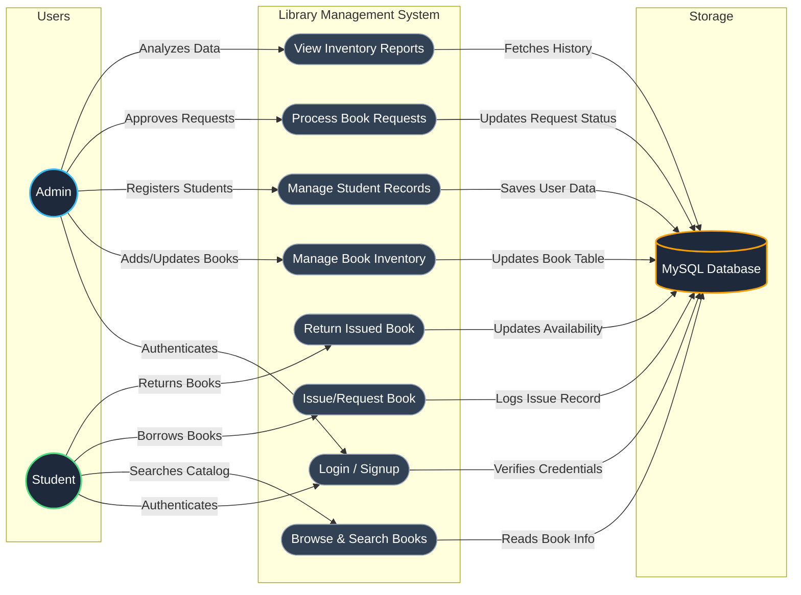

# 📚 Library Management System

A comprehensive web-based Library Management System built with Python, Flask, and MySQL. This system facilitates efficient management of books, students, and book circulation through a user-friendly interface.

## 🚀 Features

### Admin Dashboard

- **Book Management**: Add, update, delete, and view books in the library inventory.
- **Student Management**: Register new students and view existing student records.
- **Request Handling**: Review and approve book requests from students.
- **Reports**: Access detailed reports on book inventory, student lists, and book issue history.

### Student Dashboard

- **Book Catalog**: Browse through available books in the library.
- **Book Issuance**: Directly issue available books.
- **Book Requests**: Request books that might be currently unavailable or require approval.
- **Return Tracking**: Keep track of issued books and return them once finished.
- **Personal History**: View a history of all issued and returned books.

## 🛠️ Tech Stack

- **Backend**: Python 3.x, Flask
- **Database**: MySQL (PyMySQL)
- **Frontend**: HTML5, CSS3, JavaScript

## 📊 System Workflow & Use Case Diagram



## ⚙️ Setup Instructions

### 1. Database Setup

1. Ensure you have MySQL installed and running.
2. Create a database named `library_db`.
3. Create the following tables (refer to `app.py` for schema details or use the provided SQL below):

```sql
CREATE DATABASE library_db;
USE library_db;

CREATE TABLE users (
    id INT AUTO_INCREMENT PRIMARY KEY,
    username VARCHAR(50) UNIQUE NOT NULL,
    password VARCHAR(255) NOT NULL,
    role ENUM('admin', 'student') DEFAULT 'student'
);

CREATE TABLE books (
    id INT AUTO_INCREMENT PRIMARY KEY,
    title VARCHAR(255) NOT NULL,
    author VARCHAR(255) NOT NULL,
    copies INT NOT NULL,
    available INT NOT NULL
);

CREATE TABLE issue_records (
    id INT AUTO_INCREMENT PRIMARY KEY,
    user_id INT,
    book_id INT,
    issue_date TIMESTAMP DEFAULT CURRENT_TIMESTAMP,
    return_date DATE,
    status ENUM('issued', 'returned') DEFAULT 'issued',
    FOREIGN KEY (user_id) REFERENCES users(id),
    FOREIGN KEY (book_id) REFERENCES books(id)
);

CREATE TABLE book_requests (
    id INT AUTO_INCREMENT PRIMARY KEY,
    user_id INT,
    book_id INT,
    status ENUM('pending', 'approved', 'rejected') DEFAULT 'pending',
    FOREIGN KEY (user_id) REFERENCES users(id),
    FOREIGN KEY (book_id) REFERENCES books(id)
);
```

### 2. Backend Setup

1. Clone the repository.
2. Install the required Python packages:
   ```bash
   pip install flask pymysql
   ```
3. Update database credentials in `db.py`:
   ```python
   # db.py
   host='localhost',
   user='root',
   password='your_password',
   database='library_db'
   ```

### 3. Run the Application

1. Execute the Flask app:
   ```bash
   python app.py
   ```
2. Open your browser and navigate to `http://127.0.0.1:5000`.

## 📁 Project Structure

```
Library Management System/
├── app.py              # Main Flask application & API routes
├── db.py               # Database connection & configuration
├── index.html          # Frontend UI structure (HTML5)
├── style.css           # UI styling and layout (CSS3)
├── script.js           # Frontend logic & API integration (JS)
└── README.md           # Project documentation & setup guide
```
